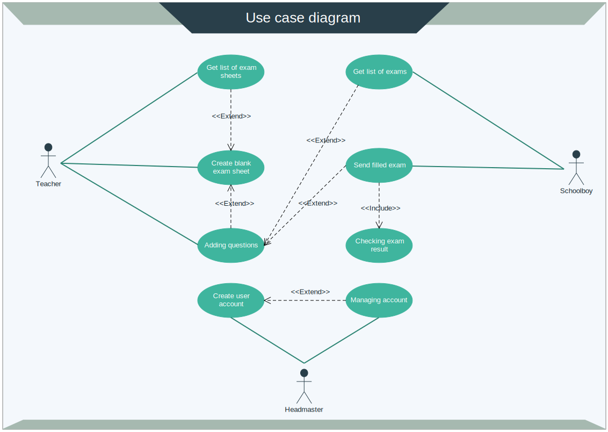

# Exam Application
**Caution!** This code was created to be a attachment for a job application. It is not suitable for commercial purposes. If you find something interesting in it, please do not hesitate to reuse.


#### Table of Contents

1. Instalation
2. Introduction
3. Application stack overview
4. Api documentation

### 1. Instalation
The repository contains all the data required to run the application.
Please ensure that you have available ports: 80 and 8000.
To start application just run listed below commands.
```
git clone git@github.com:Michael-Wisniewski/rest-api.git
cd rest-api
docker-compose -f docker-compose.yml -f docker-compose.production.yml up
```
Test coverage
```
url: http://localhost:80/tests
```
Schoolboy's account app.
```
url: http://localhost:8000
login: schoolboy
password: schoolboy
```
Teacher's account app.
```
url: http://panel.localhost:8000
login: teacher
password: teacher
```
Users accounts
```
url: http://localhost:80/admin
login: headmaster
password: headmaster
```
### 2. Introduction
**"Exam App"** is a web application which allows students and teacher to create and exchange exam tests.
It was created in accordance with the RESTful application program interface rules.

<p align="center">
    
</p>

    Application features:

    Schoolboy
        - authenticate account
        - viewing the available exams (include information about author and difficulty)
        - taking exam
        - getting exam result

    Teacher
        - authenticate account
        - viewing exam sheets (include information about exam's pass rate)
        - creating and managing of exams sheets

    Headmaster
        - managing of user accounts

    Other assumptions
        - exams are single choice tests
        - question has assigned score from 1 to 5 points
        - 60% score passes the exam
        - exam sheet can only be archived, not deleted
        - exams are single choice tests
        - exam sheets are versioned so exam result can not be saved
          if during the filling process, teacher makes any changes to it

### 3. Application stack overview

General

| Type        | Technologies           |
| ------------- |:-------------:|
| Version control system  | Git, Git Flow |
| Virtual enviromnent | Docker, Docker-Compose |

RESTful Api

| Type        | Technologies           |
| ------------- |:-------------:|
| Servers | Nginx, uWsgi |
| Database | PostgreSQL |
| Programming language | Python v.3.6 |
| Used libraries | Django, Django REST, Jsonschema |
| Debug tools | Postman |
| Tests | Pytest, Pytest-Django, Pytest-Cov, Mixer, RequestFactory |

### 4. Api documentation

#### Show schoolboy exam list.
----
  Returns json data with information shortcuts about all availables exams.

* **URL**

  localhost/v1/schoolboy/exam_list/

* **Method:**

  `GET`
  
*  **URL Params**

   None

* **Success Response:**

  * **Code:** 200 <br />
    **Content:**
    ```json 
        [
            { 
                "title" : "Math exam",
                "author" : "Michael Bloom", 
                "difficulty": "Easy", 
                "url": "http://localhost/v1/schoolboy/new_exam/1/" 
            },
            { 
                "title" : "English exam",
                "author" : "John Smith", 
                "difficulty": "Medium", 
                "url": "http://localhost/v1/schoolboy/new_exam/2/" 
            }
        ]
    ```

    OR
    
  * **Code:** 204 <br />
    **Content:**
    ```json
        { "message" : "There are no exam sheets avalible at this moment." }
    ```

**The schoolboy writes a new exam**
----
  Returns blank exam in json data format. After receiving the data with answers it sends back the exam score.

* **URL**

  localhost/v1/schoolboy/new_exam/:id/

* **Method:**

  `GET` | `POST`
  
*  **URL Params**

  **Required:**
 
  `id=[integer]` - exam sheet id

* **Success GET Response:**

  * **Code:** 200 <br />
    **Content:**
    ```json 
        {
          "id": 1,
          "title": "Math exam",
          "version": 1,
          "questions": [
                {
                      "text": "How much is two plus two?",
                      "answers": [
                            {
                              "id": 1,
                              "text": "three"
                            },
                            { 
                              "id": 2,
                              "text": "four"
                            }
                      ]
                }
          ]
        }
    ```
* **Error GET Response:**

  * **Code:** 404 <br />
    **Content:**
    ```json
        { "message" : "The exam sheet does not exist." }
    ```

    OR

  * **Code:** 404 <br />
    **Content:**
    ```json
        { "message" : "This exam is not avalible at this moment." }
    ```

    OR

  * **Code:** 410 <br />
    **Content:**
    ```json
        { "message" : "This exam is no longer avalible." }
    ```
* **POST request:**

  * **Content:**
    ```json
        { 
            "id": 1,
            "version": 3,
            "answers": [1,7]
        }
    ```

    **Required:**
 
    `id=[integer]` - exam sheet id<br />
    `version=[integer]` - version of exam sheet<br />
    `answers=[type=[array], items=[integer]]` - ids of answers
* **Success POST Response:**

  * **Code:** 200 <br />
    **Content:**
    ```json 
        { "message": "Your score is 75%" }
    ```
* **Error POST Response:**

  * **Code:** 406 <br />
    **Content:**
    ```json
        { "message" : "Corrupted data." }
    ```

    OR

  * **Code:** 406 <br />
    **Content:**
    ```json
        { "message" : "The exam sheet does not exist." }
    ```

    OR

  * **Code:** 406 <br />
    **Content:**
    ```json
        { "message" : "Wrong number of answers or answers do not correspond to questions." }
    ```

    OR

  * **Code:** 409 <br />
    **Content:**
    ```json
        { "message" : "Used exam sheet is out of date." }
    ```

    OR

  * **Code:** 410 <br />
    **Content:**
    ```json
        { "message" : "Used exam sheet is no loger avalible." }
    ```

    OR

  * **Code:** 410 <br />
    **Content:**
    ```json
        { "message" : "Used exam sheet was deleted." }
    ```
  
